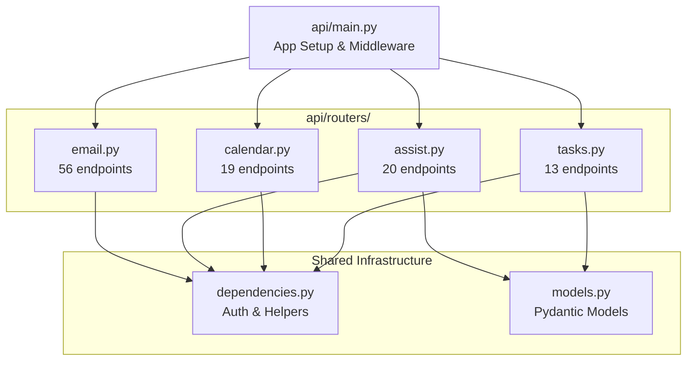
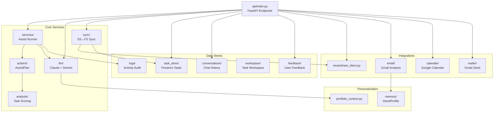
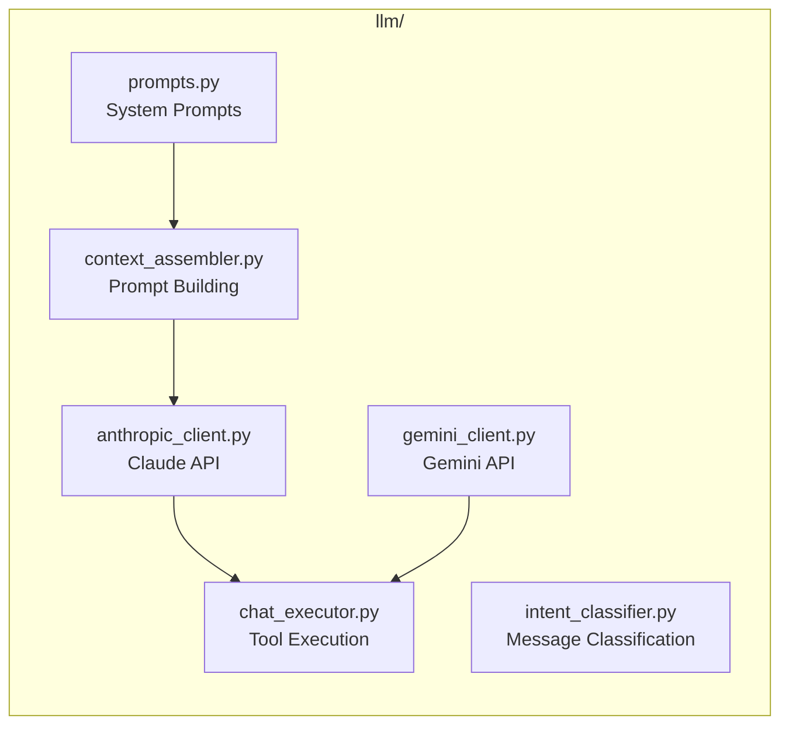
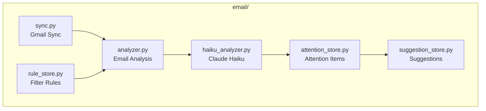
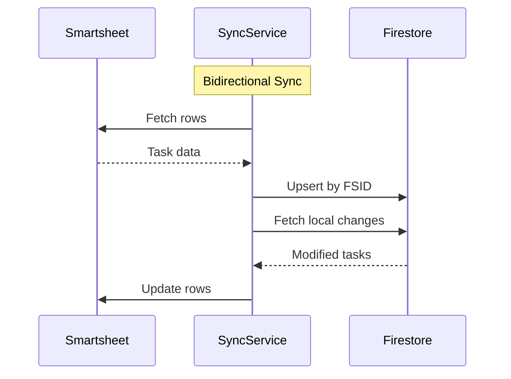

# DATA Components

> Last updated: 2026-01-21 by Architecture Agent  
> Analyzed commit: `66e5be7` (refactor/api-routers branch)

---

## API Layer (Modular Routers)

As of January 2026, the API layer uses **modular FastAPI routers** for better maintainability. This was extracted from the monolithic `api/main.py` (~8000 lines).

### Router Structure



### Router Reference

| File | Prefix | Purpose | Endpoints |
|------|--------|---------|-----------|
| `api/routers/tasks.py` | `/tasks` | Task CRUD, Firestore tasks, recurring | ~10 |
| `api/routers/tasks.py` | `/sync` | Smartsheet ↔ Firestore sync | ~3 |
| `api/routers/tasks.py` | `/work` | Work task badge count | ~1 |
| `api/routers/calendar.py` | `/calendar` | Events, settings, attention, chat | ~19 |
| `api/routers/assist.py` | `/assist` | AI assist, planning, chat, workspace | ~20 |
| `api/routers/email.py` | `/inbox`, `/email` | Inbox, attention, drafts, haiku, memory | ~56 |

**Total:** ~108 endpoints in routers

### Shared Files

| File | Purpose | Key Exports |
|------|---------|-------------|
| `api/dependencies.py` | Auth & shared helpers | `get_current_user()`, `get_settings()`, `serialize_task()` |
| `api/models.py` | Shared Pydantic models | Request/response models used across routers |

### Migration Status

- **Routers:** All domain routers created and functional
- **Original endpoints:** Still exist in `main.py` (causing duplicate warnings)
- **Next step:** Remove original endpoints from `main.py` after production validation

See [ADR-008](./DECISIONS.md#adr-008) for the architectural decision.

---

## Module Hierarchy



---

## Module Reference

### Core Application (`daily_task_assistant/`)

| Module | Description | Key Exports |
|--------|-------------|-------------|
| `actions/` | Task planning and action execution | `AssistPlan`, `plan_assist()` |
| `analysis/` | Task scoring and automation detection | `RankedTask`, `rank_tasks()`, `score_task()` |
| `api/` | Authentication middleware | `get_current_user()` |
| `calendar/` | Google Calendar integration | Event CRUD, attention tracking |
| `config.py` | Configuration loading | `load_settings()` |
| `contacts/` | Contact search and storage | `search.py`, `store.py` |
| `conversations/` | Chat history persistence | `ConversationMessage`, `CalendarConversationMessage`, `EmailConversationMessage` |
| `dataset.py` | Task dataset fetching | `fetch_tasks()` |
| `drafts/` | Email draft storage | Draft save/load |
| `email/` | Email analysis system | `analyzer.py`, `rule_store.py` |
| `feedback/` | User feedback collection | `store.py` |
| `firestore.py` | Firestore client init | Database connection |
| `llm/` | LLM integration | `anthropic_client.py`, `gemini_client.py` |
| `logs/` | Activity audit logging | `log_assist_event()`, `fetch_activity_entries()` |
| `mailer/` | Gmail API wrapper | `gmail.py`, `inbox.py` |
| `memory/` | User profile and personalization | `DavidProfile`, `get_or_create_profile()` |
| `services/` | Workflow orchestration | `execute_assist()` |
| `settings/` | Global settings | `global_settings.py` |
| `sheets/` | Google Sheets integration | `filter_rules.py` |
| `portfolio_context.py` | LLM context aggregation | `PortfolioContext`, `build_portfolio_context()` |
| `smartsheet_client.py` | Smartsheet API wrapper | `SmartsheetClient`, `MultiSheetConfig` |
| `sync/` | Bidirectional sync | `service.py` |
| `task_store/` | Firestore task CRUD | `store.py`, `recurring.py` |
| `tasks.py` | Task dataclasses | `TaskDetail`, `AttachmentDetail` |
| `trust/` | Trust events tracking | `events.py` |
| `workspace/` | Task workspace persistence | `WorkspaceData`, `save_workspace()`, `load_workspace()` |
| `interfaces/` | CLI interfaces | `chat_cli.py` |

### Skills (`skills/`)

| Skill | Purpose |
|-------|---------|
| `task_planning/` | Structured task planning with crux identification |

### Interfaces (`daily_task_assistant/interfaces/`)

| File | Purpose |
|------|---------|
| `chat_cli.py` | Interactive CLI prototype for reviewing tasks with assistant |

---

## Module Details

### `llm/` - LLM Integration



**Key Files:**
- `anthropic_client.py` - Primary Claude integration, tool definitions
- `gemini_client.py` - Gemini for intent classification and conversational chat
- `chat_executor.py` - Executes tool calls from LLM responses
- `context_assembler.py` - Builds context for LLM calls
- `prompts.py` - System prompts and templates

### `email/` - Email Analysis System



**Key Files:**
- `analyzer.py` - Main email analysis logic
- `haiku_analyzer.py` - Claude 3.5 Haiku for email analysis
- `attention_store.py` - Emails requiring action
- `rule_store.py` - Email filter rules (Google Sheets)
- `suggestion_store.py` - AI-generated suggestions
- `sync.py` - Stale email detection and auto-dismissal
- `memory.py` - Email pattern learning (sender profiles, categories)

### `email/memory.py` - Email Pattern Learning

Learns email management patterns from user decisions, enabling personalized categorization and response time expectations.

**Dataclasses:**

#### `CategoryPattern`

Learned pattern for auto-categorizing emails by domain or sender.

```python
@dataclass(slots=True)
class CategoryPattern:
    pattern_type: str  # "domain" or "sender"
    pattern: str       # Domain (amazon.com) or email address
    preferred_category: str
    confidence: float  # 0.0-1.0, increases with approvals
    sample_count: int
    approved_count: int
    dismissed_count: int
```

#### `SenderProfile`

Sender relationship tracking for VIP detection and response expectations.

```python
@dataclass(slots=True)
class SenderProfile:
    email: str
    name: str
    relationship: str  # RelationshipType enum value
    response_expectation: str  # ResponseExpectation enum value
    vip: bool
    domain: str  # "personal", "church", "work"
```

**RelationshipType values:** `spouse`, `child`, `parent`, `parent_in_law`, `sibling`, `relative`, `friend`, `work_superior`, `work_subordinate`, `work_peer`, `skip_level_superior`, `church_member`, `church_leader`, `vendor`, `service`, `unknown`

**ResponseExpectation values:** `immediate`, `same_day`, `next_day`, `within_week`, `no_expectation`

#### `TimingPatterns`

Aggregated email processing patterns.

```python
@dataclass(slots=True)
class TimingPatterns:
    peak_processing_hours: List[int]  # Hours when David processes email
    average_response_time_by_type: Dict[str, float]  # Relationship -> hours
    batch_vs_continuous: str  # "batch" or "continuous"
```

**Storage:**

- Firestore: `email_accounts/{account}/email_memory/`
- File: `email_memory/{account}/`
- See [INTEGRATIONS.md](./INTEGRATIONS.md) for env vars

### `sync/` - Smartsheet ↔ Firestore Sync



**Key Files:**
- `service.py` - Bidirectional sync logic, conflict resolution

### `task_store/` - Firestore Task Storage

**Key Files:**
- `store.py` - `FirestoreTask` dataclass, CRUD operations
- `recurring.py` - Recurring task reset logic

### `calendar/` - Google Calendar

**Key Files:**
- Event CRUD operations
- Attention tracking for upcoming events
- Calendar chat integration

---

## Dataclasses

### `TaskDetail` (`tasks.py`) - Legacy Smartsheet Model

Represents a task row from Smartsheet. Used for Smartsheet API operations.

```python
@dataclass(slots=True)
class TaskDetail:
    row_id: str
    title: str
    status: str
    due: datetime              # Target date (single date field)
    priority: str
    project: str
    assigned_to: Optional[str]
    estimated_hours: Optional[float]
    notes: Optional[str]
    next_step: str
    automation_hint: str
    source: str = "personal"   # "personal" or "work" sheet
    done: bool = False
    number: Optional[float] = None
    deadline: Optional[datetime] = None  # Hard deadline
    contact_flag: bool = False
    completed_on: Optional[datetime] = None
    recurring_pattern: Optional[List[str]] = None
    modified_at: Optional[datetime] = None
```

### `FirestoreTask` (`task_store/store.py`) - New Primary Model

Cloud-persisted task with full three-date model and sync metadata. This is the future primary task model.

```python
@dataclass(slots=True)
class FirestoreTask:
    # Identity
    id: str
    domain: str  # "personal", "church", "work"
    
    # Core fields
    title: str
    status: str   # TaskStatus enum value
    priority: str # TaskPriority enum value
    project: Optional[str]
    number: Optional[float]
    
    # Three-date model (slippage tracking)
    planned_date: Optional[date]      # When to work on it (auto-rolls)
    target_date: Optional[date]       # Original goal (never changes)
    hard_deadline: Optional[date]     # External commitment (alerts)
    times_rescheduled: int = 0        # Slippage counter
    due_date: Optional[date] = None   # Legacy - maps to planned_date
    
    # Recurring pattern
    recurring_type: Optional[str]     # "weekly" | "monthly" | "custom"
    recurring_days: Optional[List[str]]
    
    # Task details
    notes: Optional[str]
    next_step: Optional[str]
    estimated_hours: Optional[float]
    done: bool = False
    completed_on: Optional[date]
    
    # Timestamps
    created_at: datetime
    updated_at: datetime
    
    # Source tracking (for email-to-task)
    source: str = "manual"  # "email" | "manual" | "smartsheet_sync" | "chat"
    source_email_id: Optional[str]
    
    # Smartsheet sync fields
    smartsheet_row_id: Optional[str]      # Bidirectional link
    smartsheet_sheet: Optional[str]       # "personal" or "work"
    smartsheet_modified_at: Optional[datetime]
    sync_status: str = "local_only"       # "synced" | "pending" | "conflict"
    last_synced_at: Optional[datetime]
```

### `ConversationMessage` (`conversations/history.py`)

Chat history entry with plan snapshots and strike functionality.

```python
@dataclass
class ConversationMessage:
    role: Literal["user", "assistant"]
    content: str
    ts: str
    metadata: Dict[str, Any] = field(default_factory=dict)
    plan: Optional[Dict[str, Any]] = None  # Plan snapshot
    struck: bool = False                    # Soft-delete
    struck_at: Optional[str] = None
```

### `AssistPlan` (`actions/assistant.py`)

AI-generated task assistance with Task Planning Skill fields.

```python
@dataclass(slots=True)
class AssistPlan:
    task: TaskDetail
    summary: str
    score: float
    labels: List[str]
    automation_triggers: List[str]
    reasons: List[str]
    next_steps: List[str]
    efficiency_tips: List[str]
    suggested_actions: List[str]
    generator: str = "templates"
    generator_notes: List[str] = field(default_factory=list)
    
    # Task Planning Skill fields
    complexity: str = "simple"  # "simple" | "medium" | "complex"
    crux: Optional[str] = None  # Core challenge (medium/complex)
    approach_options: Optional[List[Dict[str, Any]]] = None  # Alternatives
    recommended_path: Optional[str] = None  # Suggested approach
    open_questions: Optional[List[str]] = None  # Questions to resolve
    done_when: Optional[str] = None  # Completion criteria
```

### `ContextBundle` (`llm/context_assembler.py`)

Assembled context for an LLM call.

```python
@dataclass(slots=True)
class ContextBundle:
    system_prompt: str           # Assembled system prompt
    messages: List[Dict[str, Any]]  # Message history to send
    tools: List[dict]            # Tool definitions for this intent
    estimated_tokens: int = 0    # Rough input token estimate
```

**Assembly Process:**

1. Build system prompt based on classified intent
2. Select tools for intent (`get_tools_for_intent()`)
3. Build task context (title, status, priority, due, project)
4. Add workspace content if included
5. Prepare history (last 6 turns full, older summarized)
6. Encode selected images (base64, max 3.5MB)
7. Estimate tokens (~4 chars per token)

### `DavidProfile` (`memory/profile.py`)

Global user profile for role-aware email management and personalization.

```python
@dataclass
class DavidProfile:
    user_id: str
    church_roles: List[str]           # ["Treasurer", "Head Elder", ...]
    personal_contexts: List[str]      # ["Homeowner", "Parent", ...]
    vip_senders: Dict[str, List[str]] # {"personal": ["esther"], "church": [...]}
    church_attention_patterns: Dict[str, List[str]]    # role -> keywords
    personal_attention_patterns: Dict[str, List[str]]  # context -> keywords
    not_actionable_patterns: Dict[str, List[str]]      # account -> skip patterns
    sender_blocklist: List[str]       # Privacy - DATA cannot see body
    version: str
    created_at: str
    updated_at: str
```

**Firestore Path:** `global/david/profile/current`

### `RankedTask` (`analysis/prioritizer.py`)

Task with scoring metadata for prioritization.

```python
@dataclass(slots=True)
class RankedTask:
    task: TaskDetail
    score: float
    labels: List[str]              # ["Past due", "Quick win", ...]
    automation_triggers: List[str]  # ["Draft follow-up email", ...]
    reasons: List[str]             # Score breakdown
```

### `PortfolioContext` (`portfolio_context.py`)

Aggregated portfolio statistics for LLM context.

```python
@dataclass(slots=True)
class PortfolioContext:
    perspective: str          # "personal", "church", "work", "holistic"
    total_open: int
    overdue: int
    due_today: int
    due_this_week: int
    by_priority: Dict[str, int]
    by_project: Dict[str, int]
    by_due_date: Dict[str, int]
    domain_breakdown: Dict[str, int]
    conflicts: List[str]      # Cross-domain conflicts (holistic view)
    task_summaries: List[Dict[str, Any]]  # Limited to 50 for LLM
```

### `AttentionRecord` (`email/attention_store.py`)

Email attention item with analysis results and status tracking.

```python
@dataclass
class AttentionRecord:
    # Identity
    email_id: str
    email_account: str  # "church" or "personal"
    user_id: str
    
    # Email snapshot
    subject: str
    from_address: str
    date: datetime
    snippet: str
    
    # Analysis results
    reason: str
    urgency: Literal["high", "medium", "low"]
    confidence: float  # 0.0-1.0
    suggested_action: Optional[str]
    extracted_task: Optional[str]
    matched_role: Optional[str]
    analysis_method: Literal["regex", "haiku", "profile_match", "vip"]
    
    # Status
    status: Literal["active", "dismissed", "snoozed", "task_created"]
    dismissed_reason: Optional[Literal["not_actionable", "handled", "false_positive"]]
    
    # TTL
    expires_at: datetime  # Active: 30 days, Dismissed: 7 days
```

**Firestore Path:** `email_accounts/{account}/attention/{email_id}`

### `WorkspaceData` (`workspace/store.py`)

Task workspace content for collaboration.

```python
@dataclass
class WorkspaceData:
    task_id: str
    items: List[str]  # Markdown text blocks
    updated_at: str
```

### `CalendarConversationMessage` (`conversations/calendar_history.py`)

Calendar chat message with optional event context.

```python
@dataclass
class CalendarConversationMessage:
    role: Literal["user", "assistant"]
    content: str
    ts: str
    event_context: Optional[str] = None  # Event ID being discussed
    metadata: Dict[str, Any] = field(default_factory=dict)
```

**Storage:**

- Firestore: `calendar_domains/{domain}/calendar_conversations/`
- File: `calendar_conversation_log/{domain}.jsonl`
- TTL: 7 days (see [INTEGRATIONS.md](./INTEGRATIONS.md))
- Domains: `personal`, `church`, `work`, `combined`

### `EmailConversationMessage` (`conversations/email_history.py`)

Email thread chat message with optional email context.

```python
@dataclass
class EmailConversationMessage:
    role: Literal["user", "assistant"]
    content: str
    ts: str
    email_context: Optional[str] = None  # Email ID being discussed
    metadata: Dict[str, Any] = field(default_factory=dict)
```

### `EmailThreadMetadata` (`conversations/email_history.py`)

Metadata for email conversation threads with privacy controls.

```python
@dataclass
class EmailThreadMetadata:
    thread_id: str
    account: Literal["church", "personal"]
    subject: str
    from_email: str
    from_name: Optional[str]
    sensitivity: Literal["normal", "sensitive", "blocked"]
    override_granted: bool  # User explicitly shared with DATA
    message_count: int
    expires_at: str  # TTL expiration
```

**Storage:**

- Firestore: `email_accounts/{account}/email_conversations/{thread_id}/`
- File: `email_conversation_log/{account}/{thread_id}.jsonl`
- TTL: 90 days (see [INTEGRATIONS.md](./INTEGRATIONS.md))

---

## Module Details (Extended)

### `memory/` - User Profile & Personalization

The DavidProfile system enables role-aware email detection:

- **Church roles** trigger attention for role-specific keywords (e.g., "invoice" for Treasurer)
- **VIP senders** always surface as high priority
- **Not-actionable patterns** skip known noise (e.g., "onedrive memories")
- **Sender blocklist** protects privacy for sensitive senders

**Key Functions:**
- `get_or_create_profile()` - Get profile with auto-initialization
- `add_not_actionable_pattern()` - Learn from rejection feedback
- `is_sender_blocked()` - Privacy check for email analysis

### `analysis/` - Task Scoring & Automation

The prioritizer scores tasks using weighted factors:

| Factor | Weights |
|--------|---------|
| Priority | Critical=5, Urgent=4, Important=3, Standard=2, Low=1 |
| Status | On Hold=3, Awaiting Reply=2.5, Follow-up=2, In Progress=1.5 |
| Due Date | Overdue=4, Today=3.5, ≤3 days=2.5, ≤7 days=1, Later=0.5 |
| Quick Win | ≤2 hours=+1.0 bonus |

**Automation Keywords:** Maps task text to action suggestions:
- "email", "follow up" → "Draft follow-up email"
- "schedule", "calendar" → "Propose meeting times"
- "summarize", "report" → "Generate report draft"

### `workspace/` - Task Workspace Persistence

Stores markdown content blocks per task for collaboration context.

**Key Functions:**
- `save_workspace(task_id, items)` - Save workspace content
- `load_workspace(task_id)` - Load workspace content
- `clear_workspace(task_id)` - Clear on task completion

### `logs/` - Activity Audit Logging

Records every assist call for analytics:

```python
{
    "ts": "2026-01-21T...",
    "task_id": "123456",
    "task_title": "...",
    "project": "...",
    "priority": "...",
    "anthropic_model": "claude-opus-4-5-20251101",
    "labels": ["Past due", "Quick win"],
    "automation_triggers": ["Draft follow-up email"]
}
```

### `portfolio_context.py` - LLM Context Building

Builds aggregated statistics for portfolio-level prompts:

- **Perspective filtering:** personal, church, work, holistic
- **Project filtering:** Uses `PERSONAL_PROJECTS` and `CHURCH_PROJECTS` sets
- **Conflict detection:** Identifies competing urgent tasks across domains
- **Task summaries:** Limited to 50 for LLM token efficiency

---

## Related Documentation

- [OVERVIEW.md](./OVERVIEW.md) - System overview
- [DATA_FLOW.md](./DATA_FLOW.md) - Data flow diagrams
- [INTEGRATIONS.md](./INTEGRATIONS.md) - External services
