# DATA Flow Diagrams

> Last updated: 2026-01-21 by Architecture Agent  
> Analyzed commit: `2da6f89`

---

## Task Management Flow

### Overview

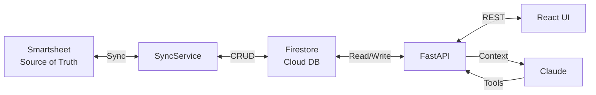

### Task Lifecycle

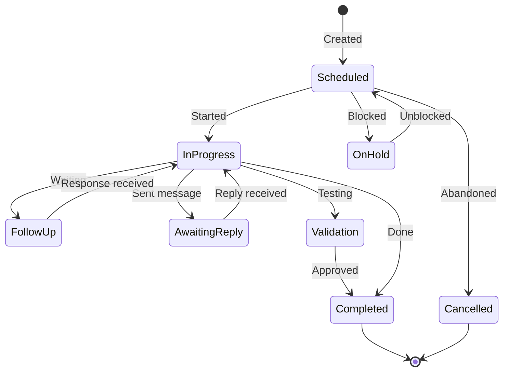

### Task Scoring Flow

Tasks are scored and ranked for display priority:

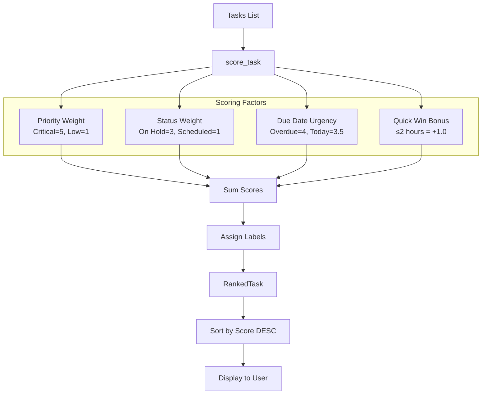

**Automation Detection:**

The `detect_automation_triggers()` function scans task text for keywords:

| Keyword | Automation Suggestion |
|---------|----------------------|
| "email", "follow up" | Draft follow-up email |
| "schedule", "calendar" | Propose meeting times |
| "summarize", "report" | Generate report draft |

### Sync Process

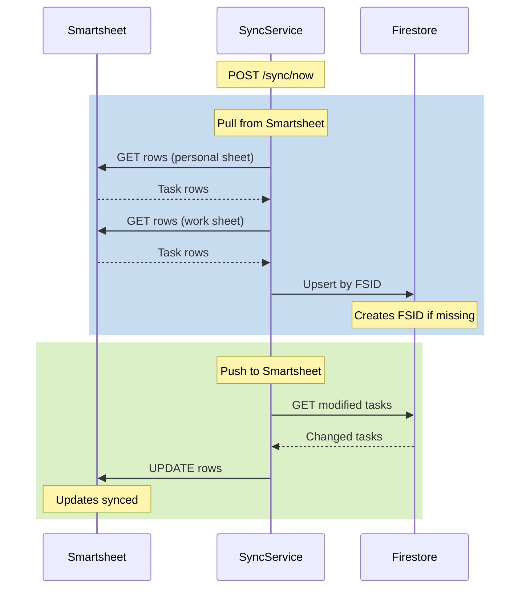

### Sync Conflict Resolution

**Strategy:** Last-updated-wins

When both Smartsheet and Firestore have changes to the same task, the system compares timestamps:

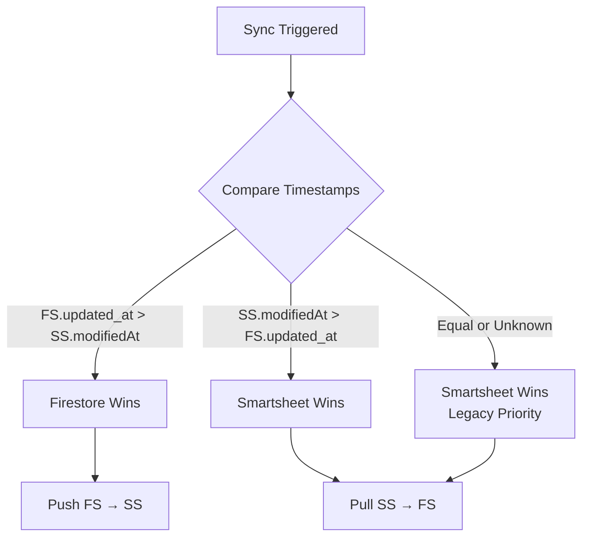

**Cross-Reference Fields:**

| System | Field | Purpose |
|--------|-------|---------|
| Smartsheet | `fsid` column | Stores Firestore task ID |
| Firestore | `smartsheet_row_id` | Stores Smartsheet row ID |
| Firestore | `smartsheet_sheet` | "personal" or "work" |
| Firestore | `smartsheet_modified_at` | Last known SS timestamp |
| Firestore | `sync_status` | "synced", "pending", "conflict" |
| Firestore | `last_synced_at` | When last sync occurred |

**Sync Status Values:**
- `local_only`: Task only exists in Firestore (DATA Task)
- `synced`: Task is in sync with Smartsheet
- `pending`: Local changes waiting to sync
- `conflict`: Conflicting changes detected (rare)
- `orphaned`: Smartsheet row deleted, needs review

### Status Translation Maps

Bidirectional mapping between Smartsheet and Firestore status values:

**Smartsheet → Firestore (`STATUS_MAP`):**

| Smartsheet Status | Firestore TaskStatus |
|-------------------|---------------------|
| Scheduled | SCHEDULED |
| Recurring | RECURRING |
| On Hold | ON_HOLD |
| In Progress | IN_PROGRESS |
| Follow-up | FOLLOW_UP |
| Awaiting Reply | AWAITING_REPLY |
| Delivered | DELIVERED |
| Validation | VALIDATION |
| Needs Approval | NEEDS_APPROVAL |
| Completed | COMPLETED |
| Cancelled | CANCELLED |
| Delegated | DELEGATED |

**Firestore → Smartsheet (`REVERSE_STATUS_MAP`):**

| Firestore TaskStatus | Smartsheet Status | Notes |
|---------------------|-------------------|-------|
| SCHEDULED | Scheduled | |
| RECURRING | Recurring | |
| ON_HOLD | On Hold | |
| IN_PROGRESS | In Progress | |
| FOLLOW_UP | Follow-up | |
| AWAITING_REPLY | Awaiting Reply | |
| BLOCKED | On Hold | Maps to same as ON_HOLD |
| DELIVERED | Delivered | |
| VALIDATION | Validation | |
| NEEDS_APPROVAL | Needs Approval | |
| COMPLETED | Completed | |
| CANCELLED | Cancelled | |
| DELEGATED | Delegated | |
| PENDING | Scheduled | Legacy status maps to Scheduled |

### Recurring Pattern Detection

The sync service detects recurring patterns from Smartsheet:

| Smartsheet Pattern | RecurringType | Days |
|-------------------|---------------|------|
| "M", "T", "W", "H", "F", "Sa" | WEEKLY | [day] |
| "Monthly" | MONTHLY | [] |

### Field Translation

Estimated hours must match Smartsheet picklist exactly:
- Valid values: `.05`, `.15`, `.25`, `.50`, `.75`, `1`, `2`, `3`, `4`, `5`, `6`, `7`, `8`

---

## Email Processing Flow

### Inbox Analysis

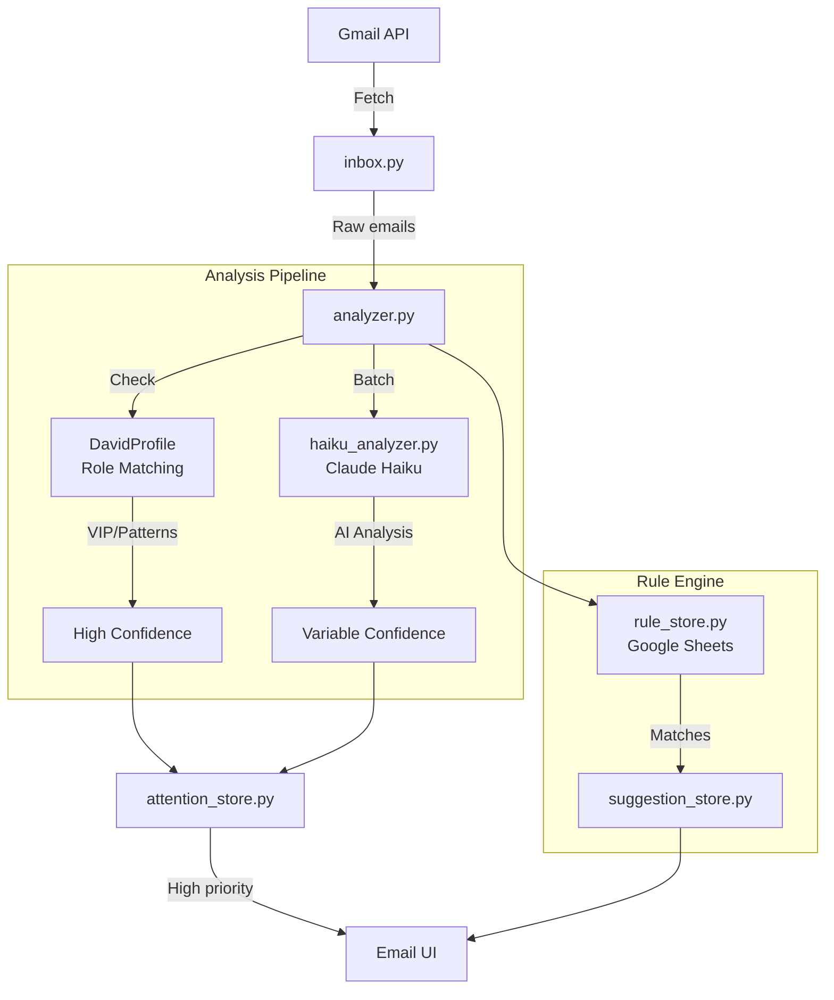

### Attention Analysis Methods

| Method | Trigger | Confidence |
|--------|---------|------------|
| `vip` | Sender in DavidProfile.vip_senders | High (0.9+) |
| `profile_match` | Keywords match role attention patterns | Medium-High |
| `haiku` | Claude Haiku semantic analysis | Variable |
| `regex` | Legacy rule matching | Medium |

### Attention TTL Management

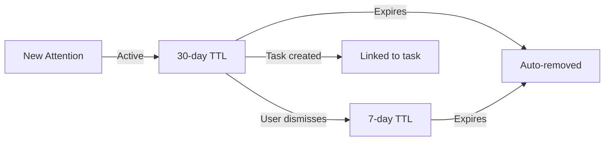

**Environment Variables:**
- `DTA_ATTENTION_TTL_ACTIVE`: Days to keep active items (default: 30)
- `DTA_ATTENTION_TTL_DISMISSED`: Days to keep dismissed items (default: 7)

### Quality Tracking (Phase 1A)

The attention system tracks user actions for quality measurement:

| Field | Purpose |
|-------|---------|
| `first_viewed_at` | When user first saw the item |
| `action_taken_at` | When user acted on it |
| `action_type` | viewed, dismissed, task_created, email_replied, ignored |
| `suppressed_by_threshold` | Hidden due to low confidence |
| `user_modified_reason` | User changed suggested reason |

### Email Action Flow

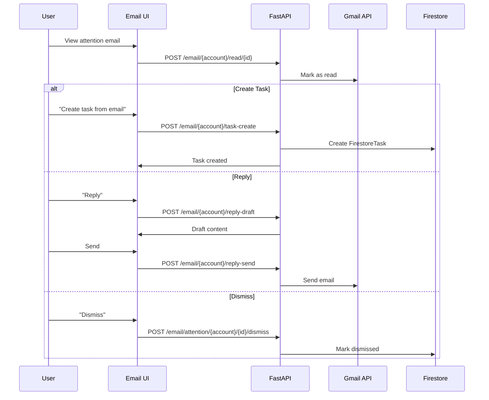

### Stale Email Detection

When emails are deleted, archived, or moved to TRASH/SPAM, referenced attention and suggestion items become "stale" and should be auto-dismissed.

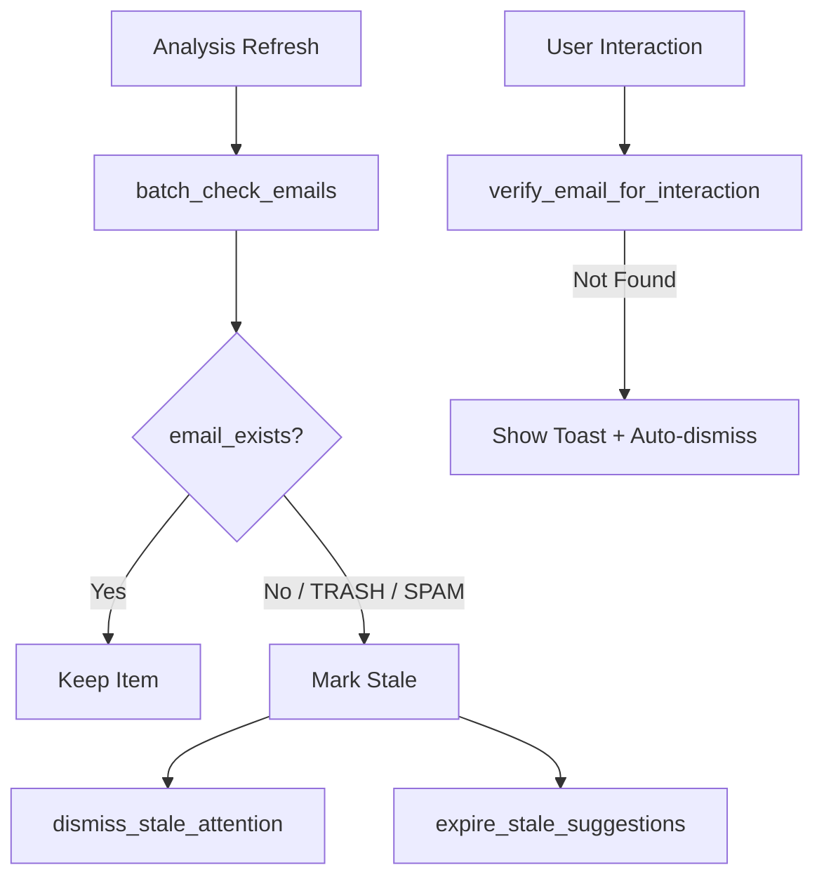

**Key Functions (`email/sync.py`):**

- `email_exists(config, email_id)` - Check Gmail existence (TRASH/SPAM = deleted)
- `batch_check_emails(config, email_ids)` - Validate multiple emails
- `sync_stale_items(account, attention, suggestions, config)` - Full sync operation
- `verify_email_for_interaction(config, email_id)` - Quick check before user action

---

## Conversation Flow

### Chat Request Lifecycle

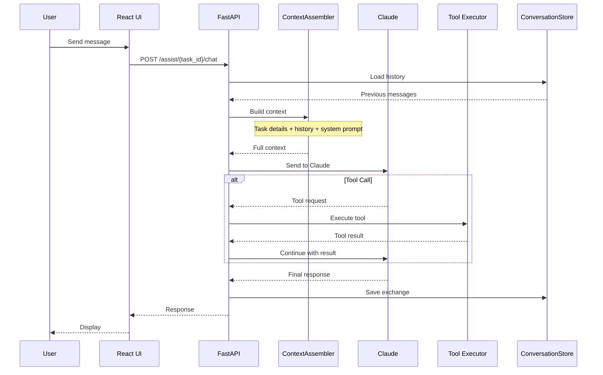

### Context Assembly Process

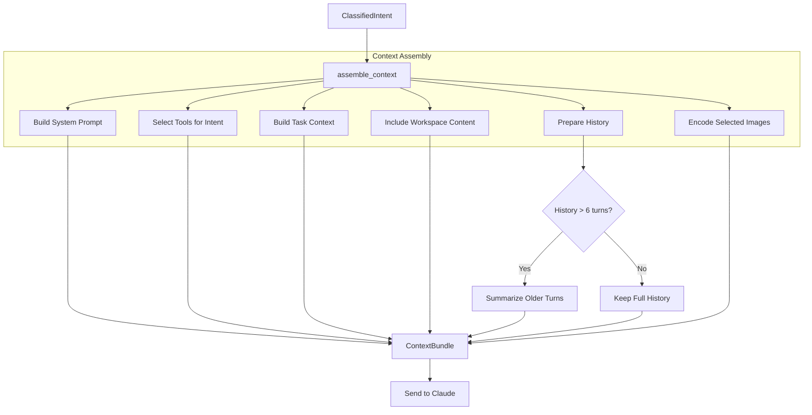

**History Summarization:**

- Action intents: Last 2 turns only
- Other intents: Last 6 turns full, older summarized to "[Previous context: ...]"

### Tool Execution

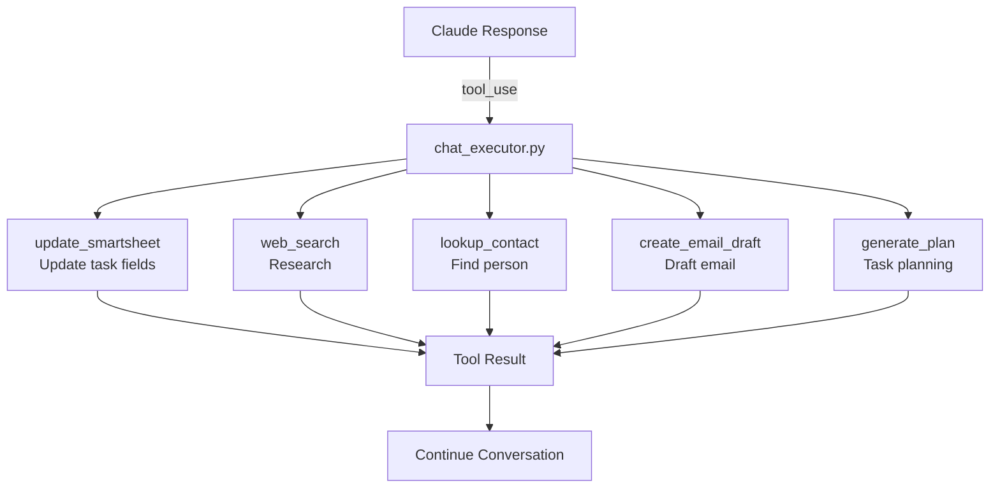

---

## Calendar Flow

### Event Management

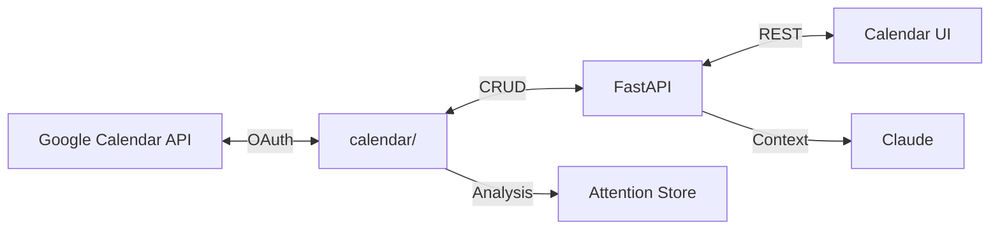

### Calendar Attention

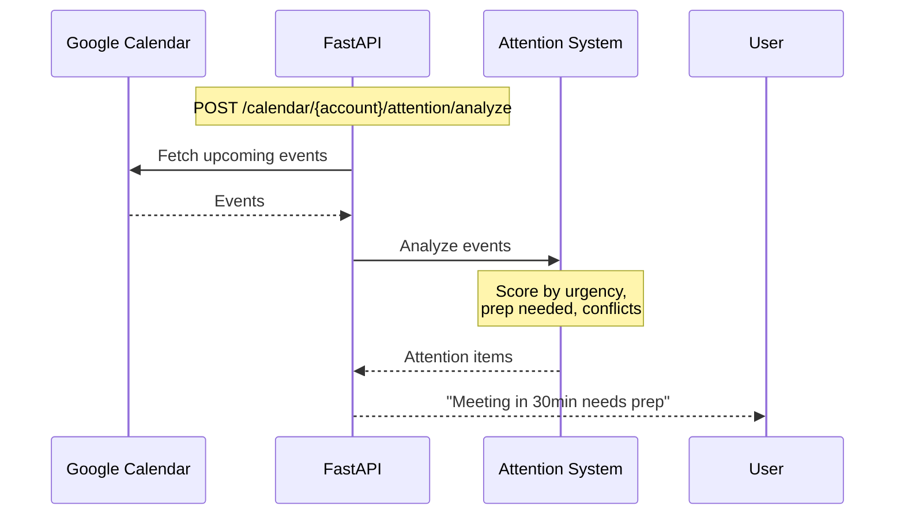

---

## State Management

### Frontend State

```mermaid
graph TD
    subgraph "React State"
        TASKS[tasks: Task[]]
        SELECTED[selectedTask: Task]
        HISTORY[chatHistory: Message[]]
        EMAIL[emails: Email[]]
    end
    
    subgraph "API Calls"
        GET_TASKS[GET /tasks]
        GET_FS[GET /tasks/firestore]
        CHAT[POST /assist/{id}/chat]
        GET_INBOX[GET /inbox/{account}]
    end
    
    GET_TASKS --> TASKS
    GET_FS --> TASKS
    SELECTED --> CHAT
    CHAT --> HISTORY
    GET_INBOX --> EMAIL
```

### Backend State

- **Firestore**: Persistent state (tasks, conversations, feedback)
- **Smartsheet**: External source of truth for tasks
- **In-memory**: Request-scoped state only
- **No session state**: Stateless API design

---

## Related Documentation

- [OVERVIEW.md](./OVERVIEW.md) - System overview
- [COMPONENTS.md](./COMPONENTS.md) - Module breakdown
- [INTEGRATIONS.md](./INTEGRATIONS.md) - External services
- [API_REFERENCE.md](./API_REFERENCE.md) - All endpoints
