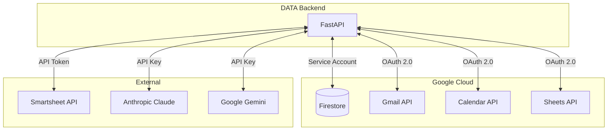
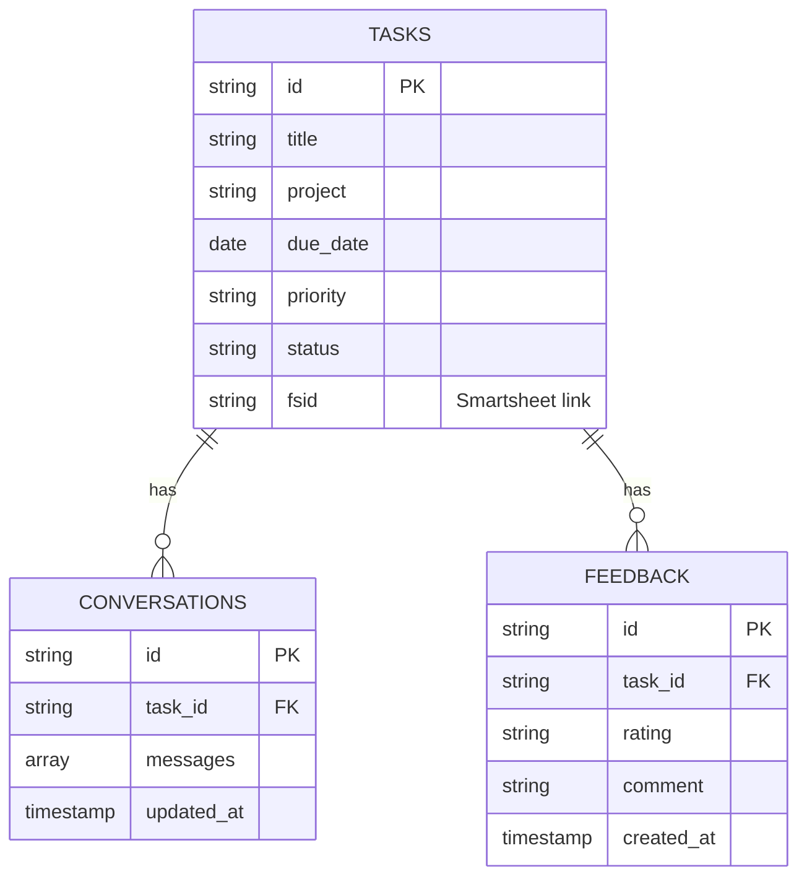
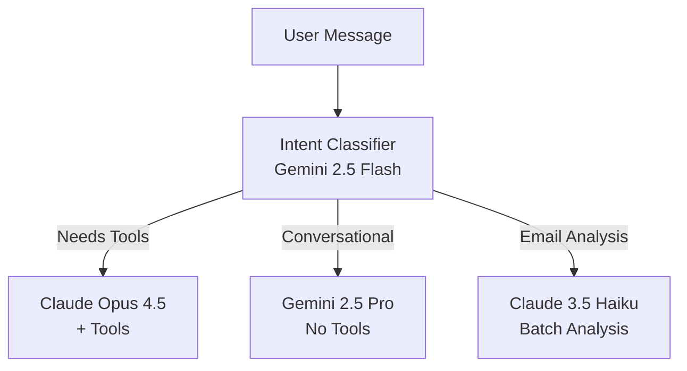
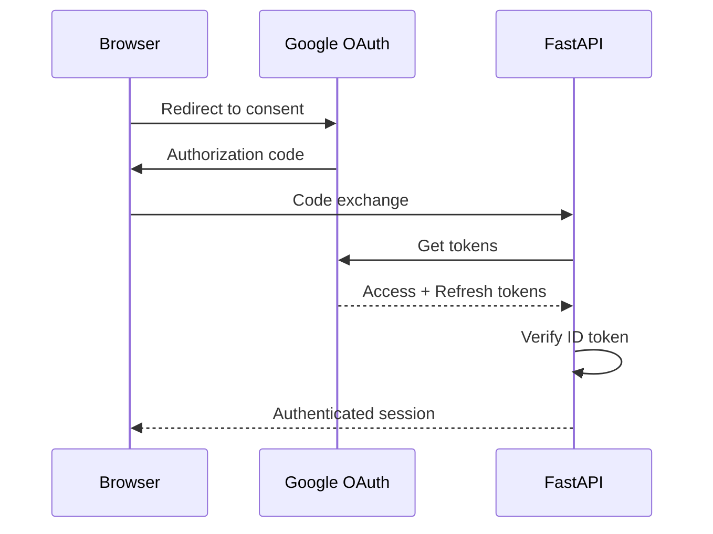

# DATA Integrations

> Last updated: 2026-01-21 by Architecture Agent  
> Analyzed commit: `2da6f89`

---

## Integration Overview



---

## Smartsheet

### Purpose
Primary source of truth for task management. David's established workflow is in Smartsheet; DATA syncs with it bidirectionally.

### Configuration
- **Module**: `smartsheet_client.py`
- **Auth**: API Token (`SMARTSHEET_API_TOKEN` env var)
- **Config**: `config/smartsheet.yml`

### Sheets

| Sheet | ID | Purpose |
|-------|------|---------|
| Personal | `4543936291884932` | Church + Personal tasks |
| Work | `5336144276678532` | Work tasks (separate context) |

### Column Mapping

```yaml
columns:
  task: "1404910744326020"      # Task title
  project: "7034410278539140"   # Project category
  due_date: "3656710558011268"  # Target date
  priority: "279010837483396"   # Priority level
  status: "8863997627158404"    # Workflow status
  done: "2108598186102660"      # Completion checkbox
  fsid: "6080706630078340"      # Firestore sync ID
```

### API Operations
- `GET /sheets/{id}/rows` - Fetch tasks
- `PUT /sheets/{id}/rows` - Update tasks
- `POST /sheets/{id}/rows` - Create tasks
- Attachments download/upload

---

## Firestore

### Purpose
Cloud persistence for tasks, conversations, feedback, and user settings.

### Configuration
- **Module**: `firestore.py`
- **Auth**: Service Account (`GOOGLE_APPLICATION_CREDENTIALS`)
- **Project**: Configured via Firebase Admin SDK

### Collections

| Collection | Purpose |
|------------|---------|
| `tasks` | FirestoreTask documents |
| `conversations` | Chat history per task |
| `feedback` | User feedback entries |
| `settings` | Global and per-user settings |
| `attention` | Email/calendar attention items |

### Data Model



---

## Anthropic Claude

### Purpose
Primary LLM powering DATA's intelligence - chat, planning, tool use.

### Configuration
- **Module**: `llm/anthropic_client.py`
- **Auth**: API Key (`ANTHROPIC_API_KEY`)

### Models Used

| Model | Purpose | Module |
|-------|---------|--------|
| Claude Opus 4.5 | Primary model for tool-heavy operations (task updates, research) | `anthropic_client.py` |
| Claude 3.5 Haiku | Email analysis (attention detection, suggestions) | `haiku_analyzer.py` |

### Tools Defined (Opus 4.5)

Claude Opus 4.5 uses these tools defined in `llm/anthropic_client.py`:

| Tool Name | Purpose | Key Parameters |
|-----------|---------|----------------|
| `update_task` | Update Smartsheet task fields | `action` (13 types), `status`, `priority`, `due_date`, `reason` |
| `web_search` | Anthropic native web search | `max_uses: 3` per conversation |
| `email_action` | Perform email operations | `action` (10 types), `reason`, `task_title`, `draft_body` |
| `calendar_action` | Create/update/delete events | `action`, `domain`, `summary`, `start_datetime`, `end_datetime` |
| `create_task` | Create new Smartsheet task | `task_title`, `due_date`, `priority`, `domain`, `project` |
| `create_email_draft` | Start new email draft | `to`, `subject`, `body` |
| `update_email_draft` | Modify existing draft | `subject`, `body` |

**`update_task` Actions:**
`mark_complete`, `update_status`, `update_priority`, `update_due_date`, `add_comment`, `update_number`, `update_contact_flag`, `update_recurring`, `update_project`, `update_task`, `update_assigned_to`, `update_notes`, `update_estimated_hours`

**`email_action` Actions:**
`archive`, `delete`, `star`, `unstar`, `mark_important`, `unmark_important`, `create_task`, `draft_reply`, `draft_reply_all`, `add_label`

**`calendar_action` Actions:**
`create_event`, `update_event`, `delete_event` (Personal and Church domains only; Work is read-only)

### Tool Context Matrix

Different chat contexts have access to different tool combinations:

| Chat Context | Tools Available | Module |
|--------------|-----------------|--------|
| Task Chat | `update_task`, `web_search`, `update_email_draft`, `create_email_draft` | `chat_with_tools()` |
| Portfolio Chat | `update_task` (with `row_id` required) | `portfolio_chat_with_tools()` |
| Email Chat | `email_action`, `web_search` | `chat_with_email()` |
| Calendar Chat | `calendar_action`, `create_task`, `update_task` | `calendar_chat()` |
| Research Mode | `web_search` | `research_with_tools()` |

### Haiku Analyzer (`email/haiku_analyzer.py`)

**Note on naming:** The file is named `haiku_analyzer.py` because it uses Claude 3.5 Haiku (model: `claude-3-5-haiku-20241022`). This is a legitimate Anthropic model, not to be confused with Gemini. Anthropic is retiring Haiku API access in February 2026, so this may migrate to a different model.

**Capabilities:**
- Email attention detection (needs David's action?)
- Action suggestions (archive, label, star)
- Rule suggestions (filter patterns)
- Privacy safeguards (domain blocklist, content masking)

### System Prompt
Defined in `llm/prompts.py` and `DATA_PREFERENCES.md`, establishing DATA's personality and capabilities.

---

## Google Gemini

### Purpose
Fast, cost-effective LLM for intent classification and conversational chat without tool use.

### Configuration
- **Module**: `llm/gemini_client.py`
- **Auth**: API Key (`GEMINI_API_KEY` env var)

### Models Used

| Model | Model ID | Purpose |
|-------|----------|---------|
| Gemini 2.5 Flash | `gemini-2.5-flash` | Intent classification (fast, cheap) |
| Gemini 2.5 Pro | `gemini-2.5-pro` | General conversational chat (quality) |

### Use Cases
- **Intent classification**: Determines if a message needs tools or can be handled conversationally
- **Conversational chat**: General queries without tool requirements
- **Planning chat**: Non-tool planning discussions

### LLM Routing Logic



---

## Gmail API

### Purpose
Read and send emails, manage drafts and labels.

### Configuration
- **Module**: `mailer/gmail.py`, `mailer/inbox.py`
- **Auth**: OAuth 2.0 (per-account tokens)
- **Scopes**: `gmail.readonly`, `gmail.send`, `gmail.modify`

### Accounts

| Account | Purpose |
|---------|---------|
| `david.a.royes@gmail.com` | Personal email |
| `david@cfbc.church` | Church email |

### Operations
- Fetch inbox/threads
- Search emails
- Mark read/unread
- Archive/delete
- Send/reply
- Manage labels

---

## Google Calendar API

### Purpose
Event management and calendar awareness.

### Configuration
- **Module**: `calendar/`
- **Auth**: OAuth 2.0 (shared with Gmail)
- **Scopes**: `calendar.readonly`, `calendar.events`

### Operations
- List calendars
- CRUD events
- Quick-add (natural language)
- Attention analysis

---

## Google Sheets API

### Purpose
Store email filter rules in a spreadsheet for easy editing.

### Configuration
- **Module**: `sheets/filter_rules.py`
- **Auth**: OAuth 2.0 (shared credentials)

### Rule Sheet Structure

| Column | Purpose |
|--------|---------|
| From | Sender pattern |
| Subject | Subject pattern |
| Action | skip, label, etc. |
| Label | Target label |

---

## Environment Variables

### External Service Credentials

| Variable | Service | Required |
|----------|---------|----------|
| `SMARTSHEET_API_TOKEN` | Smartsheet | Yes |
| `ANTHROPIC_API_KEY` | Claude (Opus 4.5 + Haiku) | Yes |
| `GOOGLE_APPLICATION_CREDENTIALS` | Firestore | Yes |
| `GEMINI_API_KEY` | Gemini (Flash + Pro) | Optional |

### Development & Auth

| Variable | Purpose | Default |
|----------|---------|---------|
| `DTA_DEV_AUTH_BYPASS` | Skip OAuth in dev mode | `0` |
| `DTA_ENV` | Environment identifier | `local` |

### Persistence Toggles (`*_FORCE_FILE`)

All stores follow the same pattern: Firestore primary with file fallback. Set to `"1"` to force local file storage:

| Variable | Store | Default Collection |
|----------|-------|-------------------|
| `DTA_PROFILE_FORCE_FILE` | DavidProfile | `global` |
| `DTA_CONVERSATION_FORCE_FILE` | Chat history | `conversations` |
| `DTA_WORKSPACE_FORCE_FILE` | Task workspace | `workspaces` |
| `DTA_TASK_STORE_FORCE_FILE` | Firestore tasks | `tasks` |
| `DTA_FEEDBACK_FORCE_FILE` | User feedback | `feedback` |
| `DTA_ACTIVITY_FORCE_FILE` | Audit log | `activity_log` |
| `DTA_ATTENTION_FORCE_FILE` | Email attention | `email_accounts/{}/attention` |
| `DTA_SUGGESTION_FORCE_FILE` | Email suggestions | `email_accounts/{}/suggestions` |
| `DTA_RULE_FORCE_FILE` | Filter rules | `email_accounts/{}/rules` |
| `DTA_ANALYSIS_FORCE_FILE` | Email analysis | `email_accounts/{}/analysis` |
| `DTA_PINNED_FORCE_FILE` | Pinned emails | `email_accounts/{}/pinned` |
| `DTA_EMAIL_MEMORY_FORCE_FILE` | Email memory | `email_memory` |
| `DTA_EMAIL_CONVERSATION_FORCE_FILE` | Email chat | `email_conversations` |
| `DTA_CALENDAR_FORCE_FILE` | Calendar cache | `calendar` |
| `DTA_CALENDAR_ATTENTION_FORCE_FILE` | Calendar attention | `calendar_attention` |
| `DTA_CALENDAR_CONVERSATION_FORCE_FILE` | Calendar chat | `calendar_conversations` |
| `DTA_CONTACTS_FORCE_FILE` | Contacts | `contacts` |
| `DTA_DRAFT_FORCE_FILE` | Email drafts | `email_drafts` |
| `DTA_HAIKU_FORCE_FILE` | Haiku usage tracking | Local file |
| `DTA_TRUST_FORCE_FILE` | Trust events | `trust_events` |

### Storage Directories (`*_DIR`)

Override default local file storage locations:

| Variable | Default Location |
|----------|-----------------|
| `DTA_PROFILE_DIR` | `profile_store/` |
| `DTA_TASK_STORE_DIR` | `task_store/` |
| `DTA_FEEDBACK_DIR` | `feedback_store/` |
| `DTA_ATTENTION_DIR` | `attention_store/` |
| `DTA_EMAIL_MEMORY_DIR` | `email_memory/` |
| `DTA_HAIKU_STORAGE_DIR` | `haiku_usage/` |
| `DTA_CALENDAR_CONVERSATION_DIR` | `calendar_conversation_log/` |
| `DTA_EMAIL_CONVERSATION_DIR` | `email_conversation_log/` |

### Collection Names (`*_COLLECTION`)

Override default Firestore collection names:

| Variable | Default |
|----------|---------|
| `DTA_PROFILE_COLLECTION` | `global` |
| `DTA_CONVERSATION_COLLECTION` | `conversations` |
| `DTA_WORKSPACE_COLLECTION` | `workspaces` |
| `DTA_ACTIVITY_COLLECTION` | `activity_log` |
| `DTA_CONTACTS_COLLECTION` | `contacts` |
| `DTA_DRAFT_COLLECTION` | `email_drafts` |

### TTL Configuration

| Variable | Purpose | Default |
|----------|---------|---------|
| `DTA_ATTENTION_TTL_ACTIVE` | Days to keep active attention items | `30` |
| `DTA_ATTENTION_TTL_DISMISSED` | Days to keep dismissed items | `7` |
| `DTA_SUGGESTION_TTL_DAYS` | Days to keep suggestions | `7` |
| `DTA_RULE_TTL_PENDING` | Days to keep pending rules | `30` |
| `DTA_RULE_TTL_APPROVED` | Days to keep approved rules | `30` |
| `DTA_RULE_TTL_REJECTED` | Days to keep rejected rules | `7` |
| `DTA_PINNED_TTL_DAYS` | Days to keep pinned emails | `30` |
| `DTA_EMAIL_CONVERSATION_TTL_DAYS` | Days to keep email chat | `90` |
| `DTA_CALENDAR_CONVERSATION_TTL_DAYS` | Days to keep calendar chat | `7` |

### Other

| Variable | Purpose |
|----------|---------|
| `DTA_ACTIVITY_LOG` | Override activity log file path |
| `DTA_ALLOWED_FRONTEND` | CORS allowed frontend URL override |

---

## Authentication Flows

### Production (OAuth)



### Development (Bypass)

```bash
# Backend
$env:DTA_DEV_AUTH_BYPASS = "1"

# Frontend
curl -H "X-User-Email: david.a.royes@gmail.com" localhost:8000/tasks
```

---

## Related Documentation

- [OVERVIEW.md](./OVERVIEW.md) - System overview
- [COMPONENTS.md](./COMPONENTS.md) - Module breakdown
- [DATA_FLOW.md](./DATA_FLOW.md) - Data flow diagrams
- [API_REFERENCE.md](./API_REFERENCE.md) - All endpoints
