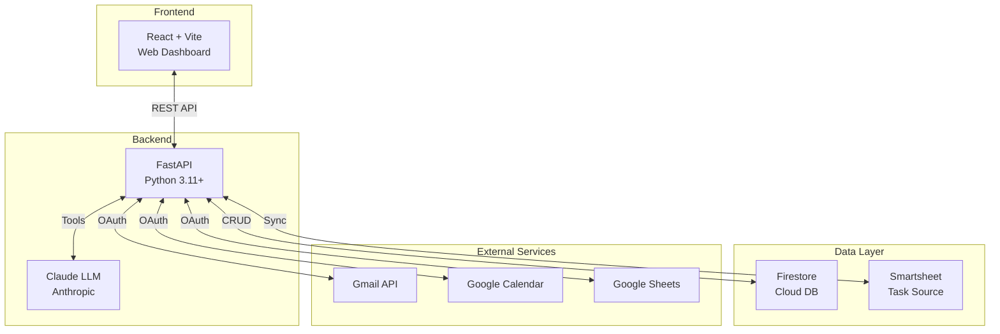
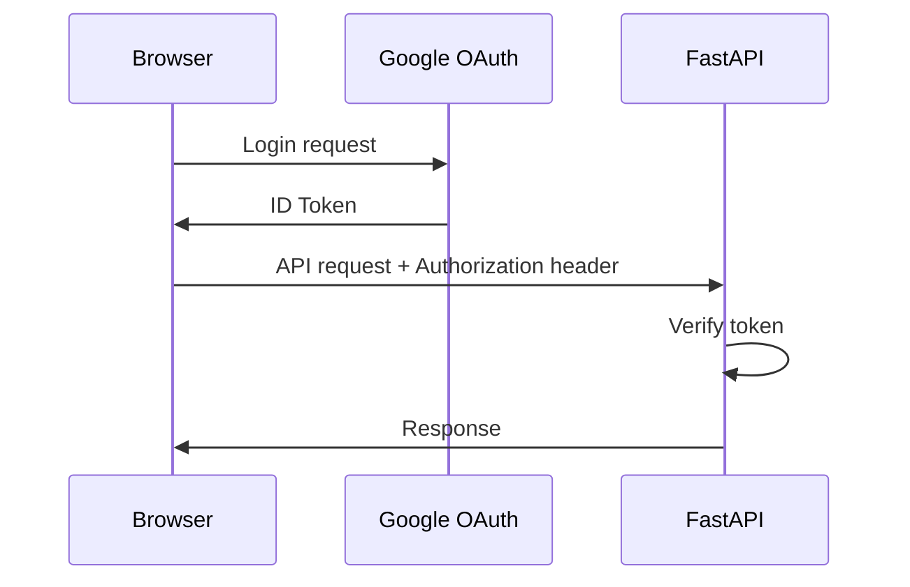

# DATA Architecture Overview

> Last updated: 2026-01-21 by Architecture Agent  
> Analyzed commit: `66e5be7` (refactor/api-routers branch)

---

## System Overview

The **Daily Task Assistant (DATA)** is a full-stack AI-powered productivity application that helps David manage tasks, emails, and calendar events with intelligent assistance.



---

## Tech Stack

### Backend (`projects/daily-task-assistant/`)

| Technology | Version | Purpose |
|------------|---------|---------|
| Python | 3.11+ | Runtime |
| FastAPI | ≥0.110 | Web framework |
| Uvicorn | ≥0.23 | ASGI server |
| Anthropic | ≥0.30 | Claude LLM |
| Firebase Admin | ≥7.1.0 | Firestore client |
| Google APIs | ≥2.100 | Gmail, Calendar, Sheets |

### Frontend (`projects/web-dashboard/`)

| Technology | Purpose |
|------------|---------|
| React 18 | UI framework |
| Vite | Build tool |
| TypeScript | Type safety |
| TailwindCSS | Styling |

### Testing (`projects/e2e-tests/`)

| Technology | Purpose |
|------------|---------|
| Playwright | E2E browser testing |
| pytest | Python unit tests |

---

## Project Structure

```
projects/
├── daily-task-assistant/     # FastAPI backend
│   ├── api/
│   │   ├── main.py           # App setup, middleware, router includes
│   │   ├── dependencies.py   # Shared auth helpers
│   │   ├── models.py         # Shared Pydantic models
│   │   └── routers/          # Modular API routers
│   │       ├── tasks.py      # /tasks, /sync, /work (~13 endpoints)
│   │       ├── calendar.py   # /calendar (~19 endpoints)
│   │       ├── assist.py     # /assist (~20 endpoints)
│   │       └── email.py      # /inbox, /email (~56 endpoints)
│   ├── daily_task_assistant/ # Core Python modules
│   │   ├── llm/              # Claude + Gemini integration
│   │   ├── email/            # Email analysis system
│   │   ├── calendar/         # Google Calendar
│   │   ├── sync/             # Smartsheet ↔ Firestore
│   │   ├── task_store/       # Firestore CRUD
│   │   └── ...               # 20+ modules
│   ├── config/               # YAML configuration
│   ├── tests/                # pytest unit tests
│   └── docs/architecture/    # This documentation
│
├── web-dashboard/            # React + Vite frontend
│   └── src/
│       ├── App.tsx           # Main application
│       ├── api.ts            # Backend API client
│       └── components/       # React components
│
└── e2e-tests/                # Playwright tests
    └── tests/
        ├── api-health.spec.ts
        ├── tasks/
        └── email/
```

---

## Deployment

### Environments

| Environment | Backend | Frontend |
|-------------|---------|----------|
| Development | `localhost:8000` | `localhost:5173` |
| Staging | Cloud Run (staging) | Vercel (staging) |
| Production | Cloud Run (prod) | Vercel (prod) |

### Authentication



**Development bypass:** Set `DTA_DEV_AUTH_BYPASS=1` and use `X-User-Email` header.

---

## Key Concepts

### Three-Date Model (FirestoreTask only)

The new `FirestoreTask` model implements a three-date system for slippage tracking:

| Field | Purpose | Behavior |
|-------|---------|----------|
| `planned_date` | When you'll work on it | Auto-rolls forward when rescheduled |
| `target_date` | Original goal date | Never changes - tracks slippage |
| `hard_deadline` | External commitment | Triggers alerts when approaching |
| `times_rescheduled` | Slippage counter | Auto-increments on reschedule |

**Note:** The legacy `TaskDetail` class (Smartsheet tasks) uses simpler `due` and `deadline` fields. The three-date model is only fully implemented in `FirestoreTask`.

### Source of Truth: Transition Period

**Current State (January 2026):**
- **Smartsheet** remains the primary source of truth for most tasks
- David has used Smartsheet for 8+ years - it's the established workflow
- **Firestore** is being tested as the future primary storage
- Bidirectional sync keeps both systems in sync during transition

**Future State:**
- Firestore will become the primary source of truth
- Smartsheet integration will be maintained for legacy compatibility
- DATA Tasks (Firestore-only) will be the default for new tasks

**Conflict Resolution:** Last-updated-wins strategy, using timestamps stored in Firestore.

### Bidirectional Sync IDs

Both systems store references to each other:
- **Smartsheet column `fsid`**: Stores Firestore task ID
- **Firestore field `smartsheet_row_id`**: Stores Smartsheet row ID
- **Firestore field `smartsheet_modified_at`**: Tracks Smartsheet's last modified timestamp

This enables duplicate prevention and conflict detection during sync.

### Domains
- **personal**: Personal tasks (included in ALL view)
- **church**: Church tasks (included in ALL view)  
- **work**: Work tasks (separate sheet, excluded from ALL)

### Attention System
AI-scored emails and calendar events requiring user action, surfaced proactively.

---

## Related Documentation

- [COMPONENTS.md](./COMPONENTS.md) - Module breakdown
- [DATA_FLOW.md](./DATA_FLOW.md) - Data flow diagrams
- [INTEGRATIONS.md](./INTEGRATIONS.md) - External services
- [API_REFERENCE.md](./API_REFERENCE.md) - All endpoints
- [DECISIONS.md](./DECISIONS.md) - Architecture decisions
